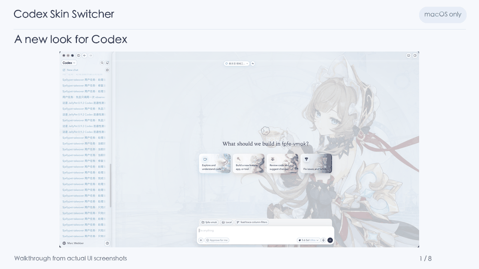
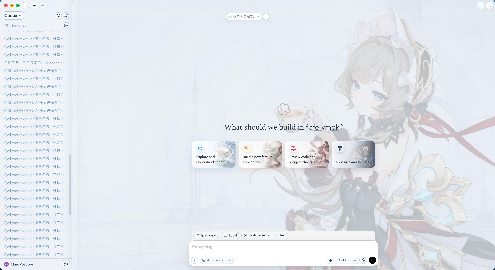
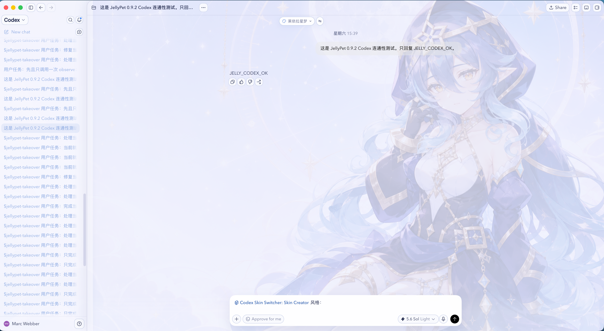
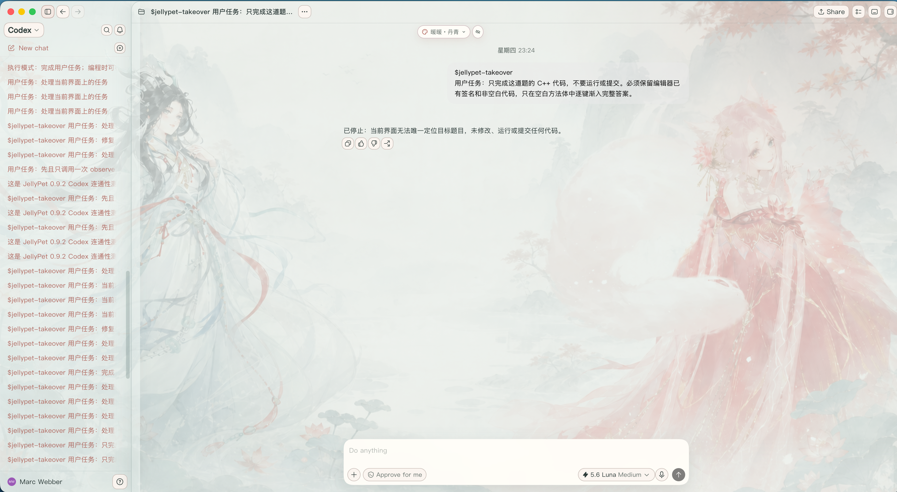
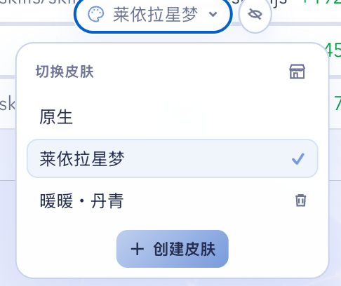
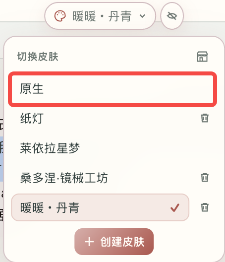
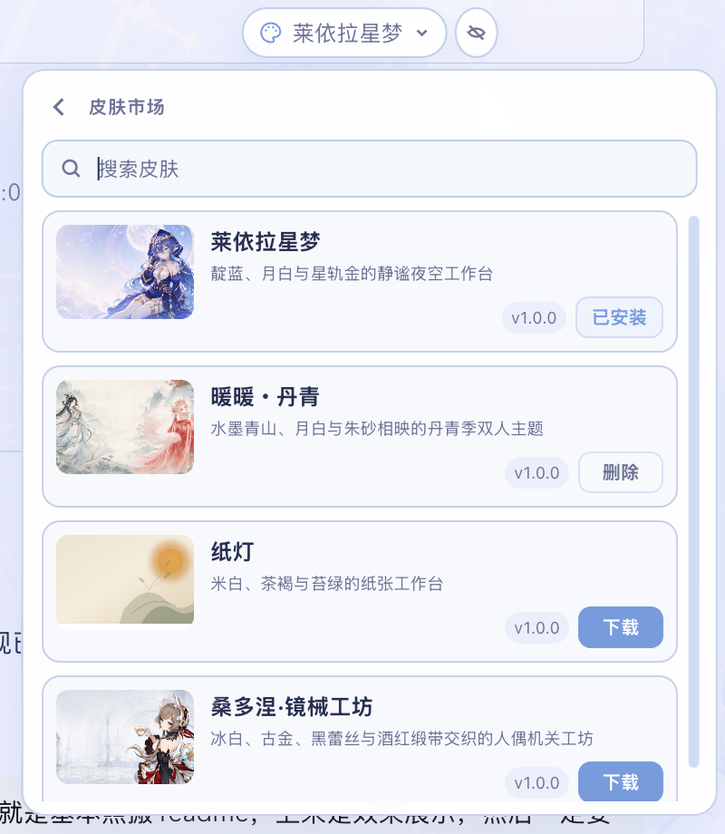
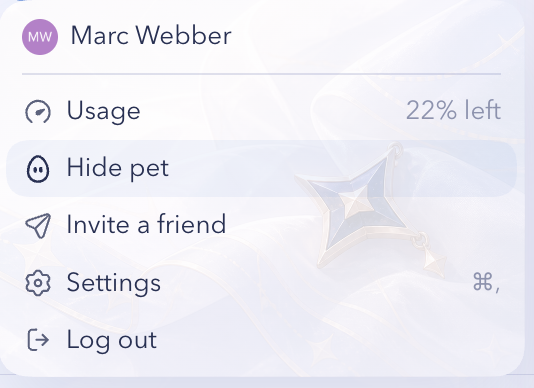
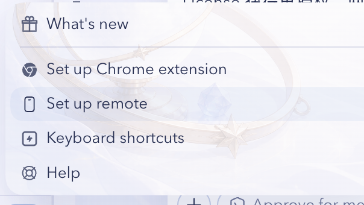
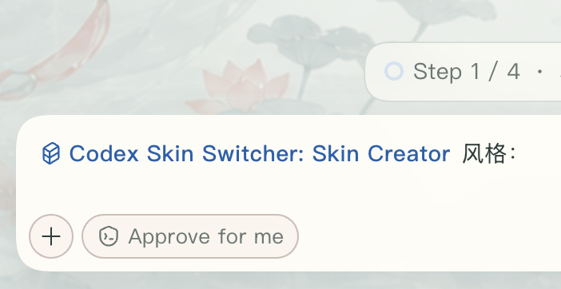

<p align="center">
  
</p>

<h1 align="center">Codex Skin Switcher</h1>

<p align="center">
  <strong>Custom skins for the Codex desktop app on macOS</strong><br>
  Pick a theme you like, or describe one and let Codex create it.
</p>

<p align="center">
  
  
  
  <a href="./LICENSE"></a>
  <a href="https://github.com/MarcWebber/codex-skin-switcher/stargazers"></a>
</p>

<p align="center">
  <a href="./README.md"><strong>中文</strong></a> ·
  <a href="#2-quickstart"><strong>Quickstart</strong></a> ·
  <a href="https://github.com/MarcWebber/codex-skin-switcher/releases/latest"><strong>Latest release</strong></a> ·
  <a href="https://github.com/MarcWebber/codex-skins"><strong>Theme market</strong></a>
</p>

# 1. Preview



This 24-second walkthrough uses actual UI screenshots. Skins can customize backgrounds, fonts, buttons, and menu illustrations while keeping Codex's native controls.

[English video](./plugins/codex-skin-switcher/assets/demo/demo-en.mp4) · [Chinese video](./plugins/codex-skin-switcher/assets/demo/demo-zh.mp4) · [Launch copy](./docs/PROMOTION.md)







Layla Starlight is bundled. Other themes are available in the in-app market.

# 2. Quickstart

## 2.1 Requirements

macOS only. Install the Codex CLI and make Node.js 22 or newer available in your PATH. The default app path is `/Applications/ChatGPT.app`; set `CODEX_APP_PATH` if your app is elsewhere.

## 2.2 Install

Run this in your terminal:

```bash
codex plugin marketplace add MarcWebber/codex-skin-switcher && codex plugin add codex-skin-switcher@marcwebber
```

Open a new Codex task after installation or an upgrade to load the plugin's skills and local service.

To upgrade an existing installation:

```bash
codex plugin marketplace upgrade marcwebber && codex plugin add codex-skin-switcher@marcwebber
```

## 2.3 Switch

Click the skin button at the top of Codex and choose Layla Starlight, or send:

```text
Switch to Layla Starlight.
```



Installation keeps your current session open. If the skin has not appeared, quit normally and open the original Codex app again. The macOS Watcher can reopen a newly launched app once to enable the local skin connection, then restore your selected theme. It leaves Codex closed after you quit.

## 2.4 Restore Native

Choose Native in the same menu, or send:

```text
Restore the native Codex interface.
```



# 3. Daily use

## 3.1 Skins

The switcher shows up to five rows before scrolling. Use the collapse button to keep only the palette icon visible. Downloaded skins have a delete action with confirmation; the bundled demo stays available.

## 3.2 Theme market

Click the small shop icon in the skin menu to browse and search the market. Downloading a theme asks whether you want to apply it.



## 3.3 Local files

Themes live here:

```text
~/Library/Application Support/CodexSkinSwitcher/themes/<theme-id>/
```

New theme directories appear in the switcher without reinstalling the plugin.

## 3.4 Menu artwork

Profile and help menus can have their own illustrations.

<table>
  <tr>
    <td width="47%"></td>
    <td width="53%"></td>
  </tr>
</table>

# 4. Create a skin

## 4.1 With a prompt

Click Create skin, then edit the text after the blue Skin Creator mention. You can attach reference images.

```text
Create a Codex skin with moonlight, stars, and muted blue colors. Keep the illustration on the right, leave the text area calm, and use 20–25% background opacity.
```



Skin Creator shows an illustration preview first, then creates, validates, and applies the theme.

## 4.2 By hand

Create a `<theme-id>` folder in the local theme directory. A basic skin needs three files:

| File | Contents |
|---|---|
| `theme.json` | Name, colors, fonts, background placement, and opacity |
| `extra.css` | Styles specific to this skin |
| `art.png` | Main background illustration |

Optional illustrations use fixed names: `profile-art.png`, `help-art.png`, and `home-card-a.png` through `home-card-d.png`.

# 5. Share a skin

Sign in to GitHub CLI before submitting:

```bash
gh auth status
```

Then ask Codex:

```text
Submit <theme-id> to the skin market.
```

Skin Creator explains which files will become public, validates the theme, prepares the market files, and opens a Pull Request in [codex-skins](https://github.com/MarcWebber/codex-skins). New themes start at `1.0.0`; updates increment the patch version.

# 6. Architecture

Skin Switcher loads local themes and handles switching, downloading, deleting, and restoring Native. Skin Creator builds themes from prompts and reference images. The separate [codex-skins repository](https://github.com/MarcWebber/codex-skins) publishes the static catalog and theme files.

[Implementation details](./plugins/codex-skin-switcher/docs/IMPLEMENTATION.md)

# 7. Troubleshooting

For a missing skin, a market loading error, or a menu that changed after a Codex update, see [Troubleshooting](./plugins/codex-skin-switcher/docs/TROUBLESHOOTING.md).

Local errors are written to:

```text
~/Library/Application Support/CodexSkinSwitcher/watcher.log
```

# 8. Support

macOS only; Node.js 22+. GitHub CLI is needed only when submitting a theme. Windows contributions are welcome through Issues and Pull Requests.

# 9. License

Code is licensed under [MIT](./LICENSE). Character and third-party artwork have their own terms; see [NOTICE](./NOTICE.md). [Privacy details](./plugins/codex-skin-switcher/docs/PRIVACY.md).
