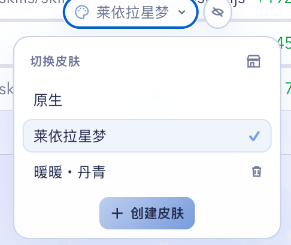
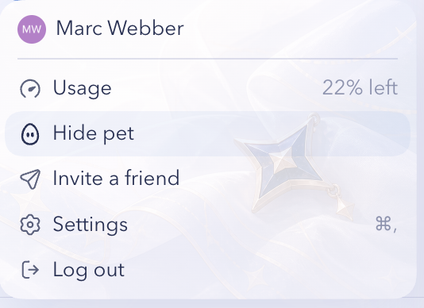
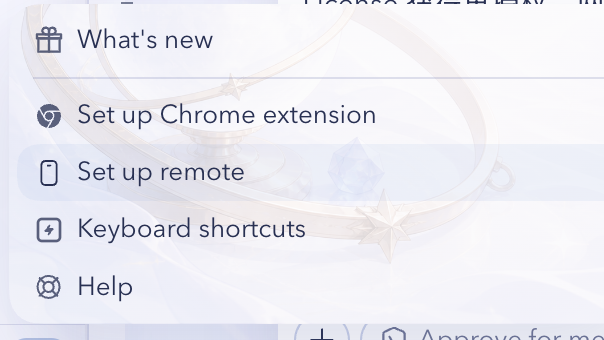
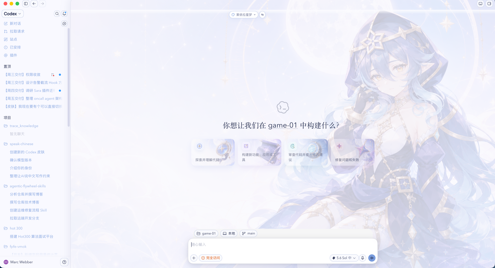
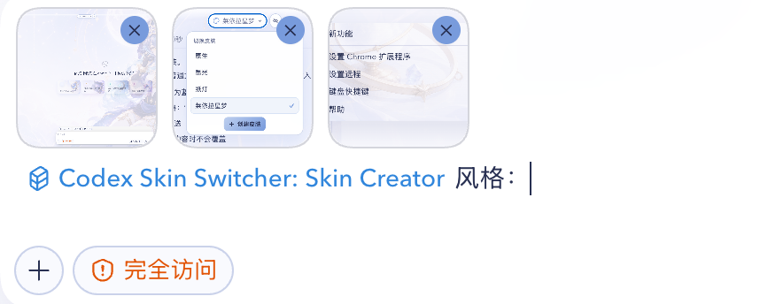
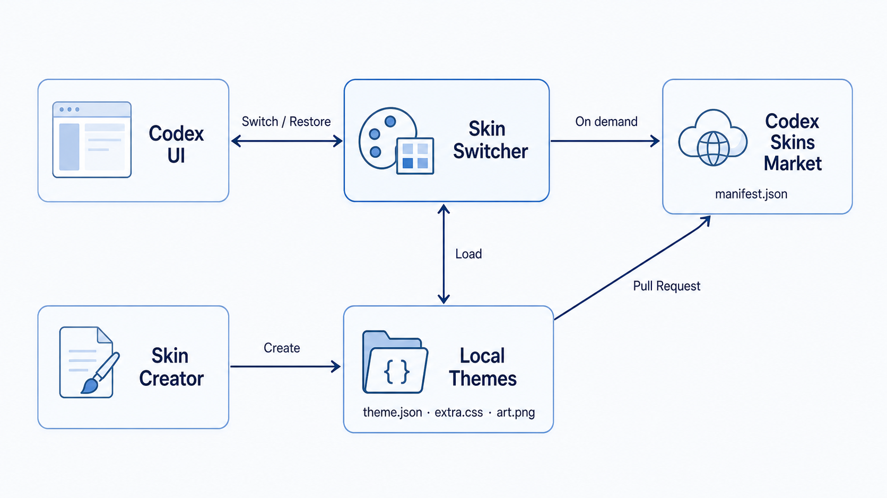

<p align="center">
  
</p>

<p align="center">
  macOS Codex 本地皮肤切换器：一键换肤、提示词创建、市场下载与原生回退。
</p>

<p align="center">
  <strong>macOS only</strong> · <strong>Local assets</strong> · <strong>Native rollback</strong>
</p>

## 1. 效果展示

<table>
  <tr>
    <td width="50%" align="center">
      
      <br><sub>本地切换：恢复原生、切换主题、删除本地皮肤</sub>
    </td>
    <td width="50%" align="center">
      
      <br><sub>皮肤市场：搜索、版本、预览、下载与删除</sub>
    </td>
  </tr>
</table>

<table>
  <tr>
    <td width="50%" align="center">
      
      <br><sub>个人菜单继续复用主体背景</sub>
    </td>
    <td width="50%" align="center">
      
      <br><sub>帮助菜单继续复用主体背景</sub>
    </td>
  </tr>
</table>



莱依拉星梦是随插件提供的功能 Demo。主体背景、主页建议卡片、侧栏、输入区、菜单与子页面使用同一套低饱和视觉语言，同时保留 Codex 原生结构与交互。

## 2. Quickstart

### 2.1 环境

当前版本只支持 macOS。请确认 PATH 中可以使用 Node.js 22 或更高版本。Codex 默认从 `/Applications/ChatGPT.app` 启动；安装在其他位置时可以额外设置 `CODEX_APP_PATH`。

### 2.2 安装

在终端运行一行命令：

```bash
codex plugin marketplace add MarcWebber/codex-skin-switcher && codex plugin add codex-skin-switcher@marcwebber
```

安装或升级后，新建一个 Codex 任务，让新的 Skill 与本地服务进入当前会话。

### 2.3 切换

点击顶部皮肤按钮并选择“莱依拉星梦”，或直接发送一行提示词：

```text
切换到莱依拉星梦
```

首次切换时，如果当前 Codex 没有开启本机调试端口，正常退出一次再重新打开。Watcher 只在下一次启动时补充本机 `9335` 参数并恢复主题，不会强制退出正在使用的 Codex。

### 2.4 恢复

在顶部菜单选择“原生”，或直接发送：

```text
恢复 Codex 原生界面
```

## 3. 日常使用

### 3.1 切换皮肤

顶部列表最多显示五项，更多主题在面板内滚动。顶部工具可以折叠为调色板图标，再次点击即可展开。

```text
切换到纸灯
```

```text
切换到暖暖·丹青
```

### 3.2 皮肤市场

点击切换菜单右上角的小店铺图标，市场会在同一个弹层中替换本地列表。市场只在打开时读取公开 Manifest，搜索在已经加载的名称、描述、作者和 ID 中完成，不会后台轮询。

下载完成后不会立即换肤，而是询问“应用”或“稍后”。选择应用时使用短暂淡入淡出过渡。

### 3.3 删除皮肤

市场下载的主题可以从市场或本地切换列表删除，两处都会先显示确认弹窗。内置 Demo 不提供删除入口；删除当前主题后自动恢复原生界面。

### 3.4 本地位置

主题文件保存在：

```text
~/Library/Application Support/CodexSkinSwitcher/themes/<theme-id>/
```

新增主题目录后，切换面板会自动发现，不需要重新安装插件。

## 4. 创建皮肤

### 4.1 一键创建

点击顶部菜单里的“创建皮肤”，在蓝色的 `skin-creator` mention 后填写风格，再手动发送。也可以直接输入一行提示词：

```text
创建一个月光、星轨和深蓝色调的 Codex 皮肤。人物放在右侧，正文区域保持安静，背景透明度控制在 20% 到 25%。
```



可以同时附上参考图。Skin Creator 会先给出插图预览，再生成主题文件、校验并应用；不会替换头像，也不会自动发送尚未编辑完成的提示词。

### 4.2 手动创建

在本地主题目录中新建一个 `<theme-id>` 文件夹。普通主题只需要编辑三个文件：

```text
theme.json
extra.css
art.png
```

`theme.json` 保存名称、顺序、颜色、字体、背景位置与透明度；`extra.css` 保存当前主题独有样式；`art.png` 是全窗口主体背景。

人物主题还可以增加固定名称的 `profile-art.png`、`help-art.png` 和 `home-card-a.png` 到 `home-card-d.png`。缺少可选图片时自动回退到 `art.png`。

## 5. 一键投稿

首次投稿前确认 GitHub CLI 已登录：

```bash
gh auth status
```

然后在 Codex 中发送：

```text
把 <theme-id> 投稿到皮肤市场
```

Skin Creator 会说明主题文件与图片将公开，然后自动创建功能分支、校验主题、生成版本与市场文件、运行市场测试并发起 Pull Request。新主题从 `1.0.0` 开始，更新已有主题时递增 patch 版本；不会直接写入或合并 `main`。

## 6. 项目架构



Skin Switcher 是唯一运行入口：它在 Codex UI 与本地主题之间完成加载、切换和原生回退；市场仅在用户打开时读取静态 Manifest；Skin Creator 负责生成本地三个核心文件，也可以把完成的主题通过 Pull Request 投稿到市场。

| 模块 | 职责 |
| --- | --- |
| Codex UI | 保留原生页面结构与交互 |
| Skin Switcher | 主题发现、CSS 注入、切换、删除、市场下载与恢复 |
| Local Themes | 保存 `theme.json`、`extra.css`、`art.png` 和可选插图 |
| Skin Creator | 根据提示词或参考图创建、预览、校验与投稿主题 |
| Codex Skins Market | 通过静态 `manifest.json` 发布可下载主题 |

## 7. 故障恢复

正常情况下选择“原生”即可撤销主题。如果入口不可用，在 Codex 中发送：

```text
恢复 Codex 原生界面
```

如果 Codex 升级后出现局部失效、背景不显示、白字白按钮、菜单失配或市场加载失败，请查看 [Troubleshooting](./plugins/codex-skin-switcher/docs/TROUBLESHOOTING.md)。注入失败时 Watcher 只提示一次并停止，随后 Codex 可以按原生方式正常启动。

## 8. 兼容性

| 项目 | 支持范围 |
| --- | --- |
| 系统 | macOS only |
| Node.js | `22+` |
| 市场投稿 | 已登录的 GitHub CLI `gh`；仅投稿时需要 |

插件只维护当前 macOS Codex 页面结构，不包含旧版本或其他平台的兼容分支。

## 9. 文档与许可

隐私说明见 [Privacy](./plugins/codex-skin-switcher/docs/PRIVACY.md)，实现结构见 [Implementation](./plugins/codex-skin-switcher/docs/IMPLEMENTATION.md)。

代码使用 [MIT License](./LICENSE)。第三方角色与图片的说明见 [NOTICE](./NOTICE.md)。

两个仓库分别承载插件与主题内容：

- [MarcWebber/codex-skin-switcher](https://github.com/MarcWebber/codex-skin-switcher)
- [MarcWebber/codex-skins](https://github.com/MarcWebber/codex-skins)

## 10. Windows

当前实现与回归范围仍是 macOS。欢迎通过 Issue 或 Pull Request 参与 Windows 启动、路径处理和界面回归适配；Windows 支持会在完成真实平台验证后正式标注。
