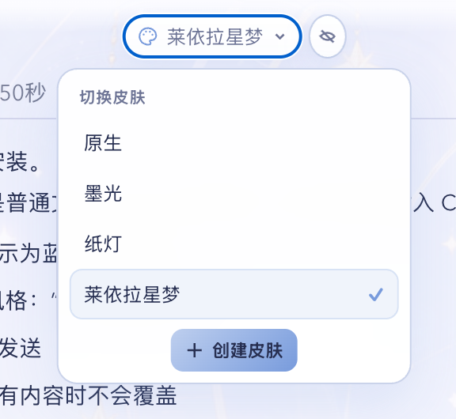
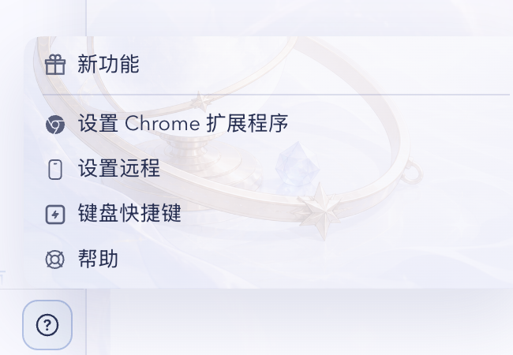

<p align="center">
  
</p>

<p align="center">
  macOS 上的 Codex 本地皮肤切换器：一键换肤、一键恢复原生，也可以用一句提示词创建新皮肤。
</p>

<p align="center">
  <strong>macOS only</strong> · <strong>Local assets</strong> · <strong>Native rollback</strong> · <strong>3-file themes</strong>
</p>


<p align="center">
  莱依拉星梦示例主题：背景、主页建议卡片、侧栏与输入区使用同一套低饱和视觉语言。
</p>

<table>
  <tr>
    <td width="50%" align="center">
      
      <br><sub>顶部切换菜单：在原生、墨光、纸灯和莱依拉星梦之间切换</sub>
    </td>
    <td width="50%" align="center">
      
      <br><sub>子页面适配：帮助菜单保留原生结构并应用主题插图</sub>
    </td>
  </tr>
</table>

## 能做什么

- 在 Codex 顶部直接切换皮肤，或随时恢复原生界面。
- 通过 `skin-creator` 输入一句提示词，生成背景、配色、字体和主题补充样式。
- 覆盖任务页、消息框、输入区、菜单、主页按钮、终端、文件与 Diff 查看器、设置页。
- 默认只读取本地主题文件，不修改 Codex 应用包，也不修改 `~/.codex/config.toml`。
- 一个最小 Watcher 只负责在下一次启动时补上本机 CDP 参数并恢复主题；没有 FPS 侦测或安装位置扫描。

## 兼容性

| 项目 | 支持范围 |
| --- | --- |
| 系统 | macOS |
| Windows | 暂不支持 |
| Node.js | `22+`，`node` 需要在 Codex 可用的 PATH 中 |

当前实现只维护 macOS 上正在使用的 Codex 页面结构，不包含旧版、Windows 或未来版本的兼容分支。它仅额外使用一个 macOS LaunchAgent 维持带参数启动。升级 Codex 后如果局部失效，先恢复原生，再按 [Troubleshooting](./plugins/codex-skin-switcher/docs/TROUBLESHOOTING.md) 更新共享宿主映射。

## 安装

```bash
codex plugin marketplace add MarcWebber/codex-skin-switcher
codex plugin add codex-skin-switcher@marcwebber
```

第一条命令注册这个 Git marketplace，第二条命令安装插件。安装或升级后，新建一个 Codex 任务，让新的 Skill 与 MCP 工具进入当前会话。

MCP 从安装后的插件根目录启动，并使用 PATH 中的 `node`。应用位置只检查 `/Applications/ChatGPT.app`；如果你确实安装在别处，可额外设置一个 `CODEX_APP_PATH`。首次选择皮肤时，如果当前 Codex 没有开启本机调试端口，正常退出一次即可；Watcher 会用 `open` 带上 `9335` 参数重开并恢复主题。

## 使用示例

### 切换皮肤

点击 Codex 顶部的“皮肤”按钮，然后选择一套主题。也可以直接对 Codex 说：

```text
切换到莱依拉星梦
切换到纸灯
恢复原生界面
```

顶部工具可以折叠为调色板图标；再次点击即可展开。
“创建皮肤”会在空输入框中插入蓝色的原生 `skin-creator` Skill mention，并留下可编辑的“风格：”；补充完风格后再由你手动发送。


### 一句话创建皮肤

```text
创建一个月光、星轨和深蓝色调的 Codex 皮肤。人物放在右侧，正文区域保持安静，背景透明度控制在 20% 到 25%。
```

也可以附上参考图：

```text
参考附件的人物服装和道具，制作一套低饱和、月白与雾蓝配色的皮肤。四个主页按钮分别使用不同的道具图标和背景，不替换头像。
```

`skin-creator` 会生成主题文件，做一次格式检查，然后应用新主题。它不会增加截图脚本、常驻测试进程或 FPS 检测。

## 内置主题

| 主题 | 说明 |
| --- | --- |
| 原生 | 移除当前界面的主题注入 |
| 莱依拉星梦 | 月白、雾蓝、星轨背景，带菜单子图和四张不同的主页按钮插图 |
| 墨璃极光 | 深色玻璃与冷色极光 |
| 纸灯 | 米白纸张与暖色灯光 |

莱依拉主题作为功能 demo 随插件提供，用来展示角色背景、菜单子图、主页按钮插图和自定义 SVG 图标能力。代码采用 MIT License；示例角色素材不因此获得 MIT 再授权，详见 [NOTICE](./NOTICE.md)。

## 修改或新增皮肤

主题保存在：

```text
~/Library/Application Support/CodexSkinSwitcher/themes/<theme-id>/
```

普通皮肤只需要编辑三个文件：

```text
theme.json   # 名称、顺序、颜色、字体、背景位置与透明度
extra.css    # 当前主题独有的补充样式
art.png      # 本地背景图
```

角色主题可以额外提供：

```text
profile-art.png
help-art.png
home-card-a.png
home-card-b.png
home-card-c.png
home-card-d.png
```

缺少可选图片时会回退到 `art.png`。新增主题目录后，切换面板会自动发现，不需要重新安装插件。

## 故障恢复

正常情况下直接选择“原生”即可撤销主题。如果切换入口不可用，可以在对话中输入：

```text
恢复 Codex 原生界面
```

Watcher 不会强制退出正在使用的 Codex；它只等待正常退出，并在下一次启动时补上本机 CDP 参数。注入失败后会提示一次、删除自己的 LaunchAgent 并停止；此后从 Dock 正常打开 Codex，不再携带调试参数。完整恢复命令、10 FPS 历史问题、背景不显示、白字白按钮、菜单与子页面失配等处理方式见 [Troubleshooting](./plugins/codex-skin-switcher/docs/TROUBLESHOOTING.md)。

## 隐私与安全

- 主题和偏好只保存在本机。
- 不上传对话、登录态、项目内容或主题图片。
- 不包含分析统计与遥测。
- CDP 只绑定 `127.0.0.1:9335`；不要将它改成局域网或公网地址。

详见 [Privacy](./plugins/codex-skin-switcher/docs/PRIVACY.md)。实现结构和技术边界见 [Implementation](./plugins/codex-skin-switcher/docs/IMPLEMENTATION.md)。

## License

代码使用 [MIT License](./LICENSE)。示例素材说明见 [NOTICE](./NOTICE.md)。
