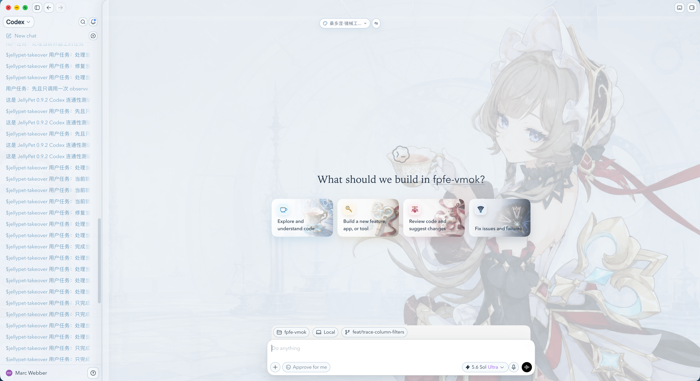
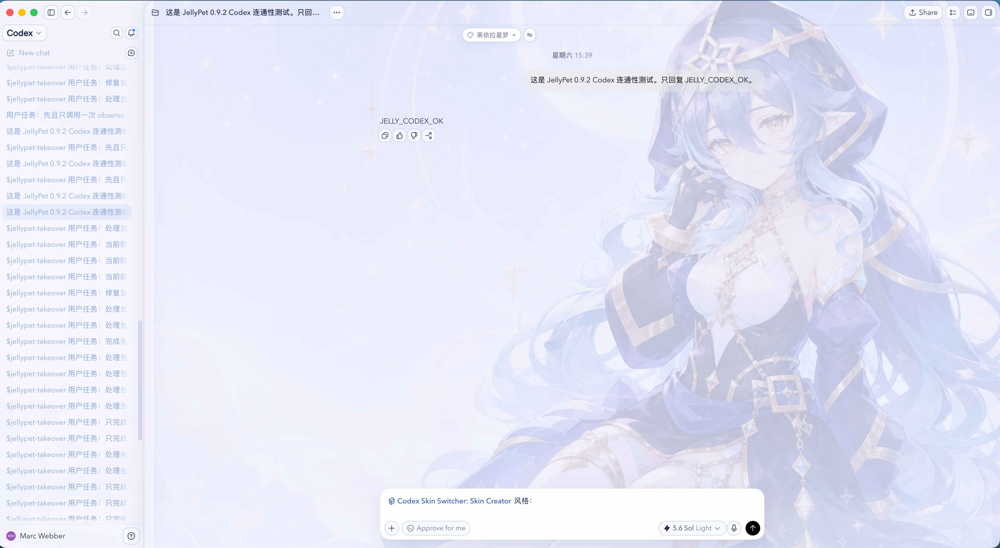
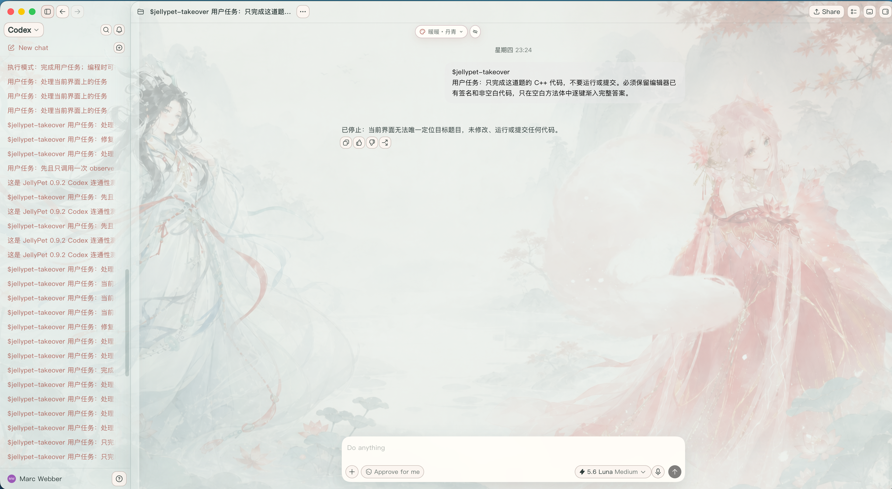
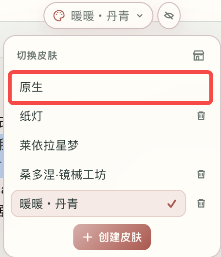
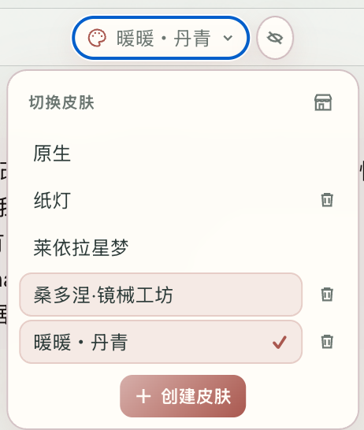
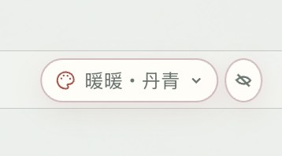
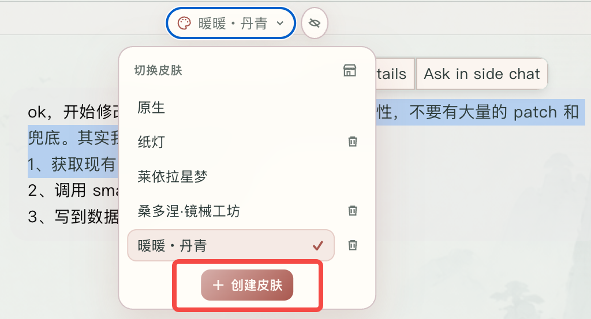
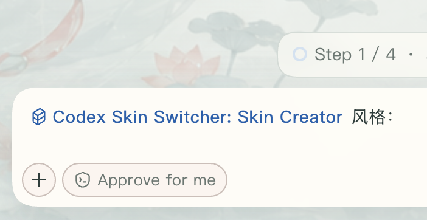

<p align="center">
  
</p>

<h1 align="center">Codex Skin Switcher</h1>

<p align="center">
  <strong>macOS Codex 本地皮肤切换器</strong><br>
  一键换肤、一键创建、一键投稿、一键下载。
</p>

<p align="center">
  <a href="#8-兼容性"></a>
  
  <a href="#8-兼容性"></a>
  <a href="./LICENSE"></a>
  
  <a href="https://github.com/MarcWebber/codex-skin-switcher/stargazers"></a>
</p>

<p align="center">
  <a href="https://github.com/MarcWebber/codex-skin-switcher"><strong>插件仓库</strong></a>
  ·
  <a href="https://github.com/MarcWebber/codex-skins"><strong>皮肤仓库</strong></a>
</p>

# 1. 效果展示







莱依拉主题是内置主题，其余主题均可从市场下载。

# 2. Quickstart

## 2.1 环境

当前版本只支持 macOS。请确认 PATH 中可以使用 Node.js 22 或更高版本。Codex 默认从 `/Applications/ChatGPT.app` 启动；安装在其他位置时可以额外设置 `CODEX_APP_PATH`。

## 2.2 安装

在终端运行一行命令：

```bash
codex plugin marketplace add MarcWebber/codex-skin-switcher && codex plugin add codex-skin-switcher@marcwebber
```

安装或升级后，新建一个 Codex 任务，让新的 Skill 与本地服务进入当前会话。

## 2.3 切换

点击顶部皮肤按钮并选择“莱依拉星梦”，或直接发送一行提示词：

```text
切换到莱依拉星梦
```

首次切换时，如果当前 Codex 没有开启本机调试端口，正常退出一次再重新打开。

## 2.4 恢复

<table>
  <tr>
    <td width="57.986%" align="center">
      
    </td>
    <td width="42.014%" align="center">
      
    </td>
  </tr>
</table>

在顶部菜单选择“原生”，或直接发送：

```text
恢复 Codex 原生界面
```

# 3. 日常使用

## 3.1 切换皮肤

顶部列表最多显示五项，更多主题在面板内滚动。顶部工具可以折叠为调色板图标，再次点击即可展开。

<table>
  <tr>
    <td width="32.0839%" align="center">
      
    </td>
    <td width="67.9161%" align="center">
      
    </td>
  </tr>
</table>

## 3.2 皮肤市场

点击切换菜单右上角的小店铺图标即可弹出皮肤市场，可以自由下载。


## 3.3 本地位置

主题文件保存在：

```text
~/Library/Application Support/CodexSkinSwitcher/themes/<theme-id>/
```

新增主题目录后，切换面板会自动发现，不需要重新安装插件。

## 3.4 菜单

个人菜单，帮助菜单均支持独立定制

<table>
  <tr>
    <td width="43.7251%" align="center">
      
    </td>
    <td width="56.2749%" align="center">
      
    </td>
  </tr>
</table>

# 4. 创建皮肤

## 4.1 一键创建

<table>
  <tr>
    <td width="48.8142%" align="center">
      
    </td>
    <td width="51.1858%" align="center">
      
    </td>
  </tr>
</table>

点击顶部菜单里的“创建皮肤”，在蓝色的 `skin-creator` mention 后填写风格。也可以直接输入一行提示词：

```text
创建一个月光、星轨和深蓝色调的 Codex 皮肤。人物放在右侧，正文区域保持安静，背景透明度控制在 20% 到 25%。
```

可以同时附上参考图。Skin Creator 会先给出插图预览，再生成主题文件、校验并应用。

## 4.2 手动创建

在本地主题目录中新建一个 `<theme-id>` 文件夹。普通主题只需要编辑三个文件：

```text
theme.json
extra.css
art.png
```

`theme.json` 保存名称、顺序、颜色、字体、背景位置与透明度；

`extra.css` 保存当前主题独有样式；

`art.png` 是全窗口主体背景。

人物主题还可以增加固定名称的 `profile-art.png`、`help-art.png` 和 `home-card-a.png` 到 `home-card-d.png`。

# 5. 一键投稿

首次投稿前确认 GitHub CLI 已登录：

```bash
gh auth status
```

然后在 Codex 中发送：

```text
把 <theme-id> 投稿到皮肤市场
```

Skin Creator 会说明主题文件与图片将公开，然后自动创建功能分支、校验主题、生成版本与市场文件、运行市场测试并发起 Pull Request。新主题从 `1.0.0` 开始，更新已有主题时递增 patch 版本。

# 6. 项目架构


Skin Switcher 从本机读取主题，负责切换、删除和恢复原生界面。

Skin Creator 把提示词和参考图做成主题；想分享时，再通过 Pull Request 投稿到 `codex-skins`。

| 模块 | 职责 |
|-|-|
| Codex UI | 保留原生页面结构与交互 |
| Skin Switcher | 发现主题，完成切换、删除、市场下载与恢复 |
| Local Themes | 保存主题配置、样式、背景和可选插图 |
| Skin Creator | 根据提示词或参考图创建、预览、校验与投稿主题 |
| Codex Skins Market | 通过静态 Manifest 发布可下载主题 |

# 7. 故障恢复

正常情况下选择“原生”即可撤销主题。如果入口不可用，在 Codex 中发送：

```text
恢复 Codex 原生界面
```

如果 Codex 升级后出现局部失效、背景不显示、白字白按钮、菜单失配或市场加载失败，请查看 [Troubleshooting](https://github.com/MarcWebber/codex-skin-switcher/blob/main/plugins/codex-skin-switcher/docs/TROUBLESHOOTING.md)。

注入失败时 Watcher 只提示一次并停止，随后 Codex 可以按原生方式正常启动。

# 8. 兼容性

| 项目 | 支持范围 |
|-|-|
| 系统 | macOS only |
| Node.js | 22+ |
| 市场投稿 | 已登录的 GitHub CLI gh；仅投稿时需要 |

# 9. 文档与许可

隐私说明见 [Privacy](https://github.com/MarcWebber/codex-skin-switcher/blob/main/plugins/codex-skin-switcher/docs/PRIVACY.md)，实现结构见 [Implementation](https://github.com/MarcWebber/codex-skin-switcher/blob/main/plugins/codex-skin-switcher/docs/IMPLEMENTATION.md)。

代码使用 [MIT License](https://github.com/MarcWebber/codex-skin-switcher/blob/main/LICENSE)。第三方角色与图片的说明见 [NOTICE](https://github.com/MarcWebber/codex-skin-switcher/blob/main/NOTICE.md)。

两个仓库分别承载插件与主题内容：

- [MarcWebber/codex-skin-switcher](https://github.com/MarcWebber/codex-skin-switcher)
- [MarcWebber/codex-skins](https://github.com/MarcWebber/codex-skins)

# 10. Welcome Windows Support

当前实现与回归范围仍是 macOS。欢迎通过 Issue 或 Pull Request 参与 Windows 启动、路径处理和界面回归适配。
